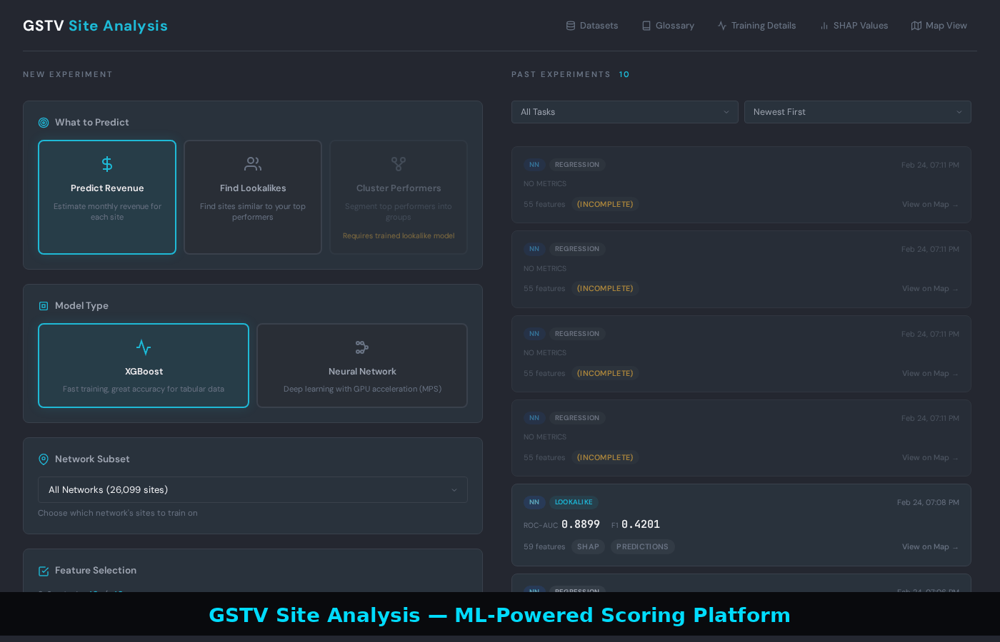

# Platinum Site Scoring Platform

> **Data download**: The source data is too large to store in the repo.
> [Download the data zip from Google Drive](https://drive.google.com/file/d/1AVj85ifnmEoBBMfPBZwXZEtYhgiPH7Ej/view?usp=sharing) and extract it into `data/input/`.

ML-powered site scoring and visualization platform for 60K+ gas station advertising sites. Train revenue prediction and lookalike classification models, explore SHAP feature importance, score sites in batch, and export results — all from a browser-based UI backed by Flask and PyTorch.



---

## Features

### Interactive Map Visualization
- WebGL-accelerated Leaflet map rendering 57K+ sites
- Color-coded markers by revenue, model score, or custom metric
- Lasso selection for multi-site analysis
- Click-to-inspect site detail panel with 8 data categories
- Real-time filtering by State, Network, Retailer, Hardware, and more

### ML Training Pipeline
- **Revenue Prediction** (regression): XGBoost or PyTorch neural network
- **Lookalike Classification**: Identify top-performing site profiles (configurable percentile bounds)
- **Deep Embedded Clustering**: Segment top performers into behavioral groups
- **Feature Selection**: Stochastic Gates (STG), LassoNet, SHAP-Select, TabNet attention, and gradient analysis
- Live training charts with loss curves, weight distributions, and metric tracking via SSE
- Apple Silicon (MPS) optimized — auto-detects M4/M3/M2 GPU

### Explainability & Scoring
- **SHAP feature importance** with interactive waterfall and summary plots
- **Tier Classification**: Executive-friendly site assessment (Recommended / Promising / Review / Not Recommended)
- **Probability Calibration**: Isotonic regression for reliable confidence scores
- **Conformal Prediction**: Prediction sets with coverage guarantees
- **Counterfactual Generation**: "What would change the prediction?" analysis
- **Fleet Analysis**: Cluster-level upgrade path recommendations

### Batch Prediction & Export
- Score all 57K+ sites or filtered subsets against any trained experiment
- CSV and Excel export with site metadata, scores, rank, and percentile
- Experiment catalog with side-by-side model comparison

### Data Lineage & Documentation
- Auto-generated data ontology (YAML) tracking 16 datasets
- Interactive dataset browser with column-level lineage
- Glossary of all features and metrics

---

## Quick Start

### 1. Install Dependencies

```bash
python -m venv venv
source venv/bin/activate
pip install -r requirements.txt
```

### 2. Add Data

Download the [data zip from Google Drive](https://drive.google.com/file/d/1AVj85ifnmEoBBMfPBZwXZEtYhgiPH7Ej/view?usp=sharing) and extract into `data/input/`.

The primary source file is `site_scores_revenue_and_diagnostics.csv` (~927MB, 1.4M rows). Auxiliary files include retailer distances, interstate distances, and base site data.

### 3. Generate Training Data

```bash
python -m site_scoring.data_transform
```

This runs the Polars-based ETL pipeline to produce:
- `data/processed/site_aggregated_precleaned.parquet` (57K sites, one row per site)
- `data/processed/site_training_data.parquet` (26K active sites with 12+ months history)

### 4. Run the App

```bash
python app.py
```

Open [http://localhost:8080](http://localhost:8080). The home page provides experiment configuration; click **Map View** for the interactive map.

---

## Project Structure

```
├── app.py                          # Flask application — all routes & API endpoints
├── requirements.txt                # Python dependencies
├── Dockerfile                      # Container build (Python 3.12-slim, gunicorn)
├── startup.sh                      # Azure Blob Storage data download for containers
│
├── src/services/                   # Web service layer
│   ├── data_service.py             # Site data loading & filtering (pandas)
│   ├── training_service.py         # ML training orchestration & job management
│   ├── shap_service.py             # SHAP computation & caching
│   ├── fleet_analysis_service.py   # Fleet-wide intervention analysis
│   └── lineage_service.py          # Data lineage & column provenance
│
├── site_scoring/                   # ML pipeline
│   ├── config.py                   # Model configuration & feature lists
│   ├── data_transform.py           # ETL pipeline (Polars-based)
│   ├── data_loader.py              # PyTorch DataLoader & DataProcessor
│   ├── model.py                    # XGBoost wrapper & PyTorch neural network
│   ├── predict.py                  # BatchPredictor for inference
│   ├── train.py                    # Standalone training entry point
│   ├── explainability/             # Explainability suite
│   │   ├── calibration.py          #   Isotonic probability calibration
│   │   ├── conformal.py            #   Conformal prediction (MAPIE)
│   │   ├── counterfactuals.py      #   DiCE counterfactual generation
│   │   ├── tiers.py                #   Executive tier classification
│   │   └── pipeline.py             #   Unified explainability pipeline
│   └── feature_selection/          # Feature selection methods
│       ├── stochastic_gates.py     #   STG (L0 regularization)
│       ├── lassonet.py             #   LassoNet feature selection
│       ├── shap_select.py          #   SHAP-based feature ranking
│       ├── gradient_analyzer.py    #   Gradient-based feature importance
│       ├── tabnet_wrapper.py       #   TabNet attention-based selection
│       ├── integration.py          #   Unified selection pipeline
│       └── config.py               #   Selection method configuration
│
├── templates/                      # Jinja2 templates
│   ├── _base.html                  # Shared layout (dark theme, nav)
│   ├── home.html                   # Experiment Hub — configure & launch training
│   ├── index.html                  # Map View — interactive map + training sidebar
│   ├── datasets_index.html         # Dataset browser
│   ├── dataset_lineage.html        # Column-level data lineage
│   ├── glossary.html               # Feature & metric glossary
│   ├── training_details.html       # Training run details & metrics
│   └── shap_values.html            # SHAP feature importance explorer
│
├── static/                         # Frontend assets
│   ├── css/                        # Stylesheets (theme, home page)
│   └── js/                         # JavaScript modules (catalog, training, utils)
│
├── tests/                          # Test suite (pytest, 14 modules)
│   ├── test_api_sites.py           # Site API endpoint tests
│   ├── test_api_training.py        # Training API tests
│   ├── test_data_loading.py        # Data pipeline tests
│   ├── test_data_service_unit.py   # Data service unit tests
│   ├── test_frontend_data.py       # Frontend data contract tests
│   ├── test_revenue_consistency.py # Revenue calculation consistency
│   ├── test_regression.py          # Regression model tests
│   ├── test_clustering_model.py    # Deep Embedded Clustering tests
│   ├── test_classification_exports.py  # Classification export tests
│   ├── test_experiment_catalog.py  # Experiment registry tests
│   ├── test_training_service_unit.py   # Training service unit tests
│   └── test_training_details_unit.py   # Training details page tests
│
├── data/
│   ├── input/                      # Source CSVs (not in repo — download above)
│   ├── processed/                  # Parquet files & exports
│   └── shapefiles/                 # US Interstate highway geodata
│
└── docs/                           # Project documentation (25+ files)
    ├── knowledge-core.md           # Accumulated learnings & ADRs
    ├── data_ontology.yaml          # Auto-generated dataset catalog
    ├── api.md                      # API reference
    ├── ARCHITECTURE.md             # System architecture overview
    ├── DATA_SOURCES.md             # Data source documentation
    ├── MODEL_TRAINING_SUMMARY.md   # Training pipeline overview
    ├── MODEL_ARTIFACT_CHECKLIST.md # Model artifact inventory
    └── ...                         # Additional module-level docs
```

---

## API Endpoints

### Pages

| Endpoint | Description |
|----------|-------------|
| `/` | Experiment Hub — configure and launch training runs |
| `/map` | Interactive map with site details and training sidebar |
| `/map/<job_id>` | Map view auto-connected to a specific training job |
| `/datasets` | Dataset browser with lineage |
| `/datasets/<id>` | Column-level lineage for a specific dataset |
| `/glossary` | Feature and metric glossary |
| `/training-details` | Training run history and metrics |
| `/shap-values` | SHAP feature importance explorer |

### Sites & Filtering

| Endpoint | Method | Description |
|----------|--------|-------------|
| `/api/sites` | GET | All sites with coordinates and revenue |
| `/api/site-details/<id>` | GET | Full site details (8 categories) |
| `/api/bulk-site-details` | POST | Batch site detail retrieval |
| `/api/filter-options` | GET | Unique values for all filterable fields |
| `/api/filtered-sites` | POST | Site IDs matching filter criteria |

### Training

| Endpoint | Method | Description |
|----------|--------|-------------|
| `/api/training/system-info` | GET | Hardware detection (Apple Silicon, MPS) |
| `/api/training/presets` | GET | Model presets with feature counts |
| `/api/training/features` | GET | Available features by type |
| `/api/training/all-features` | GET | Complete feature catalog |
| `/api/training/start` | POST | Launch a training job |
| `/api/training/stop` | POST | Stop a running job |
| `/api/training/status` | GET | Current job status |
| `/api/training/stream` | GET | SSE stream for live training progress |

### Experiments & Prediction

| Endpoint | Method | Description |
|----------|--------|-------------|
| `/api/experiments` | GET | Active in-memory experiments |
| `/api/experiments/catalog` | GET | All experiments from disk (persists across restarts) |
| `/api/experiments/compare` | POST | Side-by-side experiment comparison |
| `/api/predict/batch` | POST | Score all sites (or filtered subset) |
| `/api/predict/filtered` | POST | Score sites matching filter criteria |
| `/api/predict/export` | POST | Download scored results as CSV or Excel |

### Explainability

| Endpoint | Method | Description |
|----------|--------|-------------|
| `/api/shap/available` | GET | Check if SHAP data exists |
| `/api/shap/summary` | GET | Top feature importance rankings |
| `/api/shap/plots` | GET | SHAP plot data for visualization |
| `/api/explainability/available` | GET | Calibration & tier pipeline status |
| `/api/explainability/explain` | POST | Single-site tier classification |
| `/api/explainability/explain-batch` | POST | Batch tier classification |
| `/api/explainability/tier-summary` | POST | Fleet-wide tier distribution |
| `/api/explainability/fleet-analysis` | POST | Start fleet intervention analysis |
| `/api/explainability/fleet-analysis/status/<id>` | GET | Fleet analysis job progress |
| `/api/explainability/export-report/<id>` | GET | Download fleet analysis Excel report |

---

## ML Configuration

| Task | Target | Model Options | Notes |
|------|--------|---------------|-------|
| Regression | `avg_monthly_revenue` | XGBoost, Neural Network | Predicts monthly ad revenue |
| Lookalike | Binarized by percentile | XGBoost, Neural Network | p90–p100 default (configurable) |
| Clustering | Latent space | Deep Embedded Clustering | Segments top performers into groups |

### Feature Set

60 default features across 3 types:
- **Numeric (13)**: Revenue momentum (relative strength), distance to retailers/interstates, demographics
- **Categorical (7)**: Network, program, experience type, hardware, retailer, fuel brand, restaurant brand
- **Boolean (40)**: Capabilities (EMV, NFC, 24hr), ad category restrictions, sell flags

Features are user-selectable in the UI. SHAP importance is computed after every training run.

---

## Deployment

### Docker

```bash
docker build -t platinum-scoring .
docker run -p 8080:8080 -v /path/to/data:/app/data/input platinum-scoring
```

### Azure (with Blob Storage)

The `startup.sh` script downloads source data from Azure Blob Storage at container startup. Set the following environment variables:

```
AZURE_STORAGE_ACCOUNT, AZURE_STORAGE_KEY, AZURE_BLOB_CONTAINER
```

---

## Testing

```bash
pytest tests/ -v --ignore=tests/slow
```

---

## Key Dependencies

| Package | Purpose |
|---------|---------|
| Flask | Web framework |
| PyTorch | Neural network training (MPS-accelerated) |
| XGBoost | Gradient boosting models |
| Polars | High-performance ETL (10–20x faster than pandas) |
| scikit-learn | Preprocessing, metrics, calibration |
| SHAP | Feature importance explanations |
| MAPIE | Conformal prediction with coverage guarantees |
| DiCE-ML | Counterfactual explanations |
| GeoPandas | Geographic data & distance calculations |
| Leaflet.js | Interactive map (via CDN) |
| Chart.js | Training visualizations (via CDN) |
