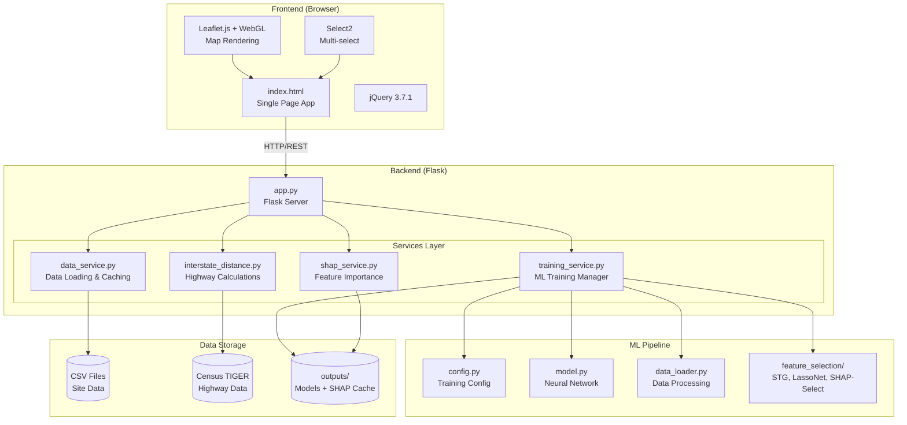
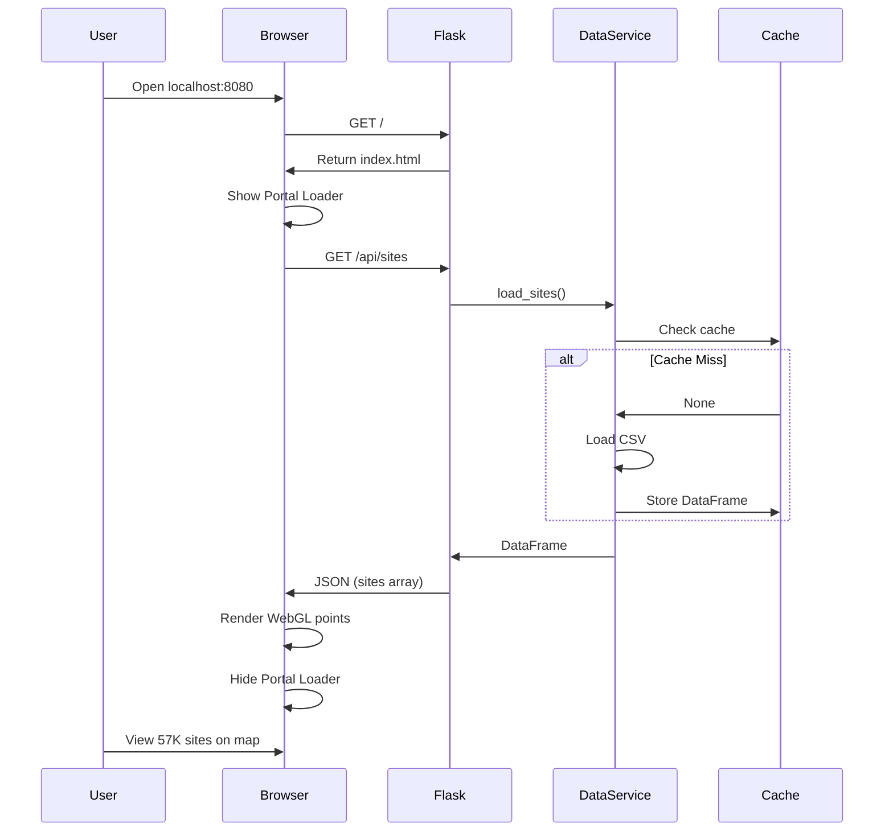
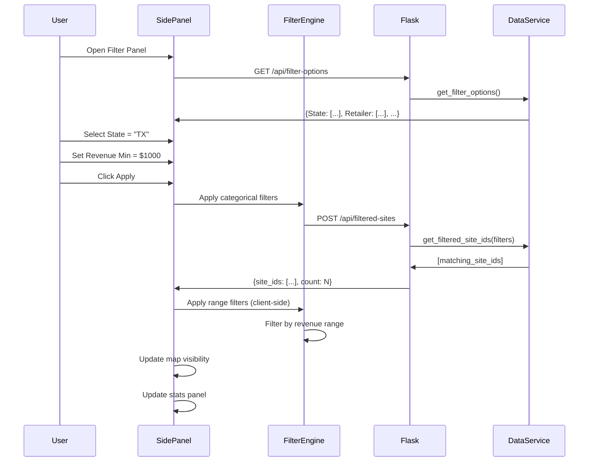
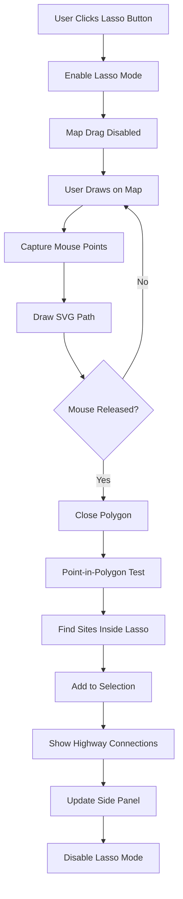
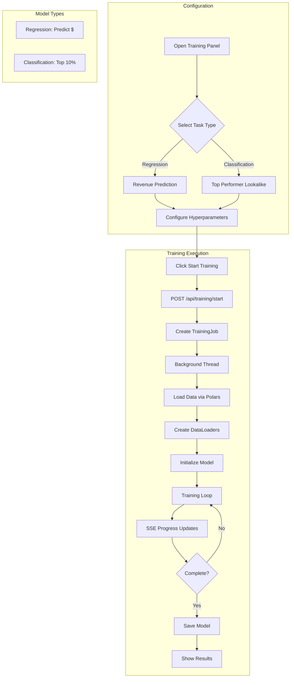
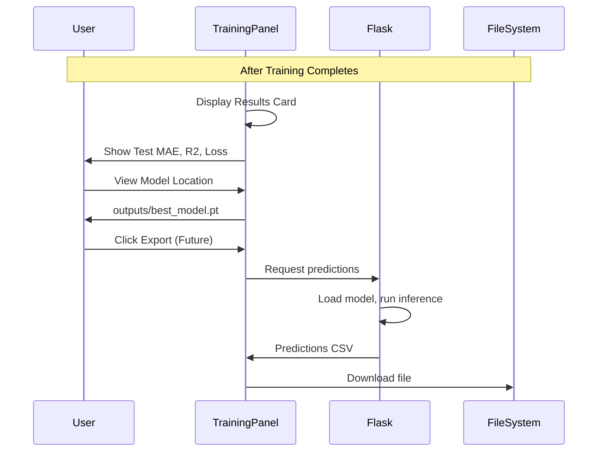
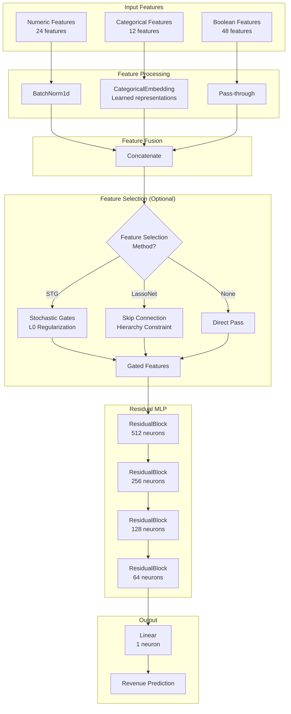
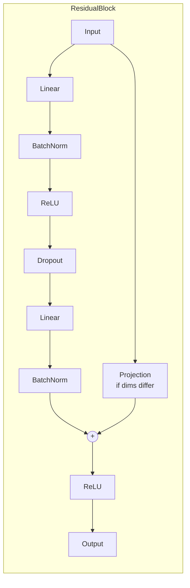

# GSTV Geospatial Site Visualization - Architecture Documentation

A comprehensive visual guide to the system architecture, data flows, and component interactions.

---

## Table of Contents

1. [System Architecture Overview](#1-system-architecture-overview)
2. [Data Flow Diagram](#2-data-flow-diagram)
3. [User Workflow Diagrams](#3-user-workflow-diagrams)
4. [Frontend Component Structure](#4-frontend-component-structure)
5. [API Endpoint Reference](#5-api-endpoint-reference)
6. [ML Pipeline Architecture](#6-ml-pipeline-architecture)
7. [Database Schema](#7-data-schema)

---

## 1. System Architecture Overview

### High-Level Architecture



### ASCII Fallback

```
+------------------------------------------------------------------+
|                        FRONTEND (Browser)                         |
|  +------------------+  +------------------+  +------------------+ |
|  |    index.html    |  |   Leaflet.js     |  |    Select2       | |
|  |  Single Page App |  |   WebGL Maps     |  |  Multi-select    | |
|  +--------+---------+  +--------+---------+  +--------+---------+ |
+-----------|----------------------|-----------------------|--------+
            |                      |                       |
            v                      v                       v
+------------------------------------------------------------------+
|                       HTTP/REST API                               |
+------------------------------------------------------------------+
            |
            v
+------------------------------------------------------------------+
|                      BACKEND (Flask - app.py)                     |
|  +---------------+  +----------------+  +------------------+      |
|  | data_service  |  |training_service|  |interstate_distance|     |
|  | - load_sites  |  | - start/stop   |  | - distance calc  |      |
|  | - filters     |  | - SSE stream   |  | - spatial index  |      |
|  +---------------+  +----------------+  +------------------+      |
|                            |                                      |
|  +---------------+         |         +------------------+         |
|  | shap_service  |<--------+-------->| feature_selection|         |
|  | - importance  |                   | - STG, LassoNet  |         |
|  | - plots       |                   | - SHAP-Select    |         |
|  +---------------+                   +------------------+         |
+------------------------------------------------------------------+
            |                      |                       |
            v                      v                       v
+------------------------------------------------------------------+
|                        DATA LAYER                                 |
|  +------------------+  +------------------+  +------------------+ |
|  |   CSV Files      |  |   ML Pipeline    |  |   TIGER Roads    | |
|  | Site Scores.csv  |  | PyTorch Models   |  |  Census Bureau   | |
|  |                  |  | SHAP Cache       |  |                  | |
|  +------------------+  +------------------+  +------------------+ |
+------------------------------------------------------------------+
```

---

## 2. Data Flow Diagram

### Complete Data Flow

```mermaid
flowchart LR
    subgraph "Data Sources"
        CSV[("Site Scores CSV<br/>1.47M rows")]
        TIGER[("TIGER Roads<br/>US Interstates")]
    end

    subgraph "Data Service Layer"
        LOAD[Load & Parse<br/>pandas/polars]
        CACHE[In-Memory Cache<br/>Module Singletons]
        METRICS[Revenue Metrics<br/>Aggregation]
        FILTER[Filter Engine<br/>Categorical + Range]
    end

    subgraph "API Layer"
        SITES_API[/api/sites]
        DETAILS_API[/api/site-details/:id]
        FILTER_API[/api/filtered-sites]
        HIGHWAY_API[/api/highway-connections]
        TRAIN_API[/api/training/*]
    end

    subgraph "Frontend Rendering"
        WEBGL[WebGL Points<br/>Leaflet.glify]
        PANEL[Side Panel<br/>Site Details]
        STATS[Stats Panel<br/>Aggregations]
        PROGRESS[Training Progress<br/>SSE Stream]
    end

    CSV --> LOAD
    TIGER --> LOAD
    LOAD --> CACHE
    CACHE --> METRICS
    CACHE --> FILTER

    CACHE --> SITES_API
    CACHE --> DETAILS_API
    FILTER --> FILTER_API
    CACHE --> HIGHWAY_API

    SITES_API --> WEBGL
    DETAILS_API --> PANEL
    FILTER_API --> STATS
    HIGHWAY_API --> WEBGL
    TRAIN_API --> PROGRESS
```

### ASCII Fallback

```
DATA SOURCES                 PROCESSING                    API                    FRONTEND
============                 ==========                    ===                    ========

+---------------+
| Site Scores   |
| CSV (1.47M)   |----+
+---------------+    |       +----------------+
                     +------>|  Data Service  |
+---------------+    |       |  - load_sites  |       +------------------+      +-----------+
| TIGER Roads   |----+       |  - cache data  |------>| /api/sites       |----->| WebGL Map |
| (Interstates) |            |  - metrics     |       +------------------+      +-----------+
+---------------+            +----------------+
                                    |
                                    |              +------------------+      +-----------+
                                    +------------->| /api/site-details|----->| Side Panel|
                                    |              +------------------+      +-----------+
                                    |
                                    |              +------------------+      +-----------+
                                    +------------->| /api/filtered    |----->| Stats Bar |
                                    |              +------------------+      +-----------+
                                    |
                                    |              +------------------+      +-----------+
                                    +------------->| /api/highway     |----->| Connection|
                                                   +------------------+      | Lines     |
                                                                             +-----------+

+---------------+            +----------------+      +------------------+      +-----------+
| Training Data |----------->| Training Svc   |----->| /api/training/*  |----->| Progress  |
| (from cache)  |            | - PyTorch      |      | (SSE Stream)     |      | Panel     |
+---------------+            | - MPS/CPU      |      +------------------+      +-----------+
                             +----------------+
```

---

## 3. User Workflow Diagrams

### 3.1 Loading and Viewing Sites



### ASCII Fallback

```
User          Browser           Flask           DataService        Cache
 |               |                |                 |                |
 |--Open App---->|                |                 |                |
 |               |---GET /------->|                 |                |
 |               |<--index.html---|                 |                |
 |               |                |                 |                |
 |           [Show Loader]        |                 |                |
 |               |                |                 |                |
 |               |--GET /api/sites--------------->load_sites()       |
 |               |                |                 |--Check cache-->|
 |               |                |                 |<--DataFrame----|
 |               |<---------------JSON sites array--|                |
 |               |                |                 |                |
 |           [Render WebGL]       |                 |                |
 |           [Hide Loader]        |                 |                |
 |               |                |                 |                |
 |<--View Map----|                |                 |                |
```

### 3.2 Filtering Sites (Categorical + Range)



### ASCII Fallback

```
CATEGORICAL FILTERS                    RANGE FILTERS
===================                    =============

1. User opens Side Panel               1. User sets min/max values
2. Load filter options from API        2. Apply on keypress (debounced)
3. User selects values                 3. Client-side filtering
4. POST to /api/filtered-sites         4. Update point visibility
5. Backend returns matching IDs        5. Recalculate statistics
6. Update map to show only matches

Filter Flow:
+----------+     +----------+     +-----------+     +----------+
| Category |---->| API Call |---->| Intersect |---->| Display  |
| Filters  |     | (Server) |     | Results   |     | on Map   |
+----------+     +----------+     +-----------+     +----------+
                                        ^
+----------+                            |
| Range    |----------------------------+
| Filters  |     (Client-side)
+----------+
```

### 3.3 Lasso Selection



### ASCII Fallback

```
                    LASSO SELECTION WORKFLOW
                    ========================

+------------------+
| 1. Click Button  |
| "Lasso Select"   |
+--------+---------+
         |
         v
+------------------+
| 2. Enter Mode    |
| - Disable pan    |
| - Show hint      |
+--------+---------+
         |
         v
+------------------+
| 3. Draw Path     |<----+
| - Track mouse    |     |
| - Render SVG     |     |
+--------+---------+     |
         |               |
         v               |
+------------------+     |
| 4. Mouse up?     |--No-+
+--------+---------+
         | Yes
         v
+------------------+
| 5. Process       |
| - Close polygon  |
| - Ray casting    |
| - Find points    |
+--------+---------+
         |
         v
+------------------+
| 6. Select Sites  |
| - Highlight pts  |
| - Show details   |
| - Draw highways  |
+------------------+
```

### 3.4 Training a Model (Regression vs Classification)



### ASCII Fallback

```
TRAINING WORKFLOW
=================

1. CONFIGURE                  2. EXECUTE                    3. MONITOR
-----------                   ----------                    ----------

+------------------+         +------------------+         +------------------+
| Select Task Type |         | POST /start      |         | SSE Stream       |
| - Regression     |-------->| - Create job     |-------->| - Epoch progress |
| - Classification |         | - Start thread   |         | - Loss/Metrics   |
+------------------+         +------------------+         +------------------+
        |                            |                            |
        v                            v                            v
+------------------+         +------------------+         +------------------+
| Set Hyperparams  |         | Load Data        |         | Update UI        |
| - Epochs: 50     |         | - Polars CSV     |         | - Progress bar   |
| - Batch: 4096    |         | - Split datasets |         | - Metric cards   |
| - LR: 1e-4       |         | - Normalize      |         | - Log entries    |
| - Dropout: 0.2   |         +------------------+         +------------------+
+------------------+                  |                            |
        |                            v                            v
        v                   +------------------+         +------------------+
+------------------+        | Train Loop       |         | Complete         |
| Select Device    |        | - Forward pass   |         | - Save model.pt  |
| - MPS (Apple GPU)|        | - Backward pass  |         | - Show R2, MAE   |
| - CPU            |        | - Update weights |         | - Export option  |
+------------------+        +------------------+         +------------------+
```

### 3.5 Viewing Predictions and Exporting Results



---

## 4. Frontend Component Structure

### JavaScript Module Architecture

```mermaid
graph TD
    subgraph "Global State"
        MAP[map - Leaflet Instance]
        SITES[allSites - Array]
        SELECTED[selectedSites - Set]
        FILTERS[activeFilters - Object]
        METRICS[siteMetrics - Object]
    end

    subgraph "Initialization"
        INIT[initApp] --> INITMAP[initMap]
        INIT --> INITSEL[initSelect2]
        INIT --> INITEVT[setupEventListeners]
        INIT --> LOAD[loadSites]
    end

    subgraph "Map Functions"
        RENDER[renderSites<br/>WebGL Points]
        UPDATE[updatePointColors]
        CONN[drawConnections<br/>Highway Lines]
    end

    subgraph "Selection Functions"
        LASSO[Lasso Mode]
        CLICK[Click Select]
        MULTI[Multi-select Dropdown]
    end

    subgraph "Filter Functions"
        CATFILT[Categorical Filters]
        RANGEFILT[Range Filters]
        APPLY[applyFilters]
    end

    subgraph "Training Functions"
        SYSINFO[loadSystemInfo]
        START[startTraining]
        STOP[stopTraining]
        STREAM[SSE Stream Handler]
    end

    subgraph "UI Functions"
        PANEL[openSidePanel]
        DETAILS[loadSiteDetails]
        STATS[updateStats]
        LEGEND[showLegend]
    end

    LOAD --> RENDER
    LOAD --> INITSEL

    LASSO --> SELECTED
    CLICK --> SELECTED
    MULTI --> SELECTED

    SELECTED --> CONN
    SELECTED --> DETAILS

    APPLY --> RENDER
    APPLY --> STATS

    START --> STREAM
    STREAM --> STATS
```



### ASCII Fallback

```
FRONTEND COMPONENT STRUCTURE
============================

GLOBAL STATE
------------
map              - Leaflet map instance
allSites[]       - All site data from API
selectedSites    - Set of selected GTVIDs
activeFilters{}  - Current filter state
glifyLayer       - WebGL point layer

INITIALIZATION SEQUENCE
-----------------------
initApp()
    |
    +-- initPortalLoader()    Create animated loading screen
    +-- initMap()             Initialize Leaflet + dark tiles
    +-- initSelect2()         Setup multi-select dropdown
    +-- setupEventListeners() Bind all event handlers
    +-- loadSites()           Fetch /api/sites
    +-- loadFilterOptions()   Fetch /api/filter-options
    +-- loadSystemInfo()      Fetch /api/training/system-info

MAP RENDERING
-------------
renderSites(sites)
    |
    +-- Create glify points layer
    +-- Color by revenue score (green gradient)
    +-- Setup click handlers
    +-- Fit bounds to data

updatePointColors()
    |
    +-- Recalculate colors based on filters
    +-- Highlight selected sites (blue)
    +-- Dim filtered-out sites

SELECTION SYSTEM
----------------
Lasso Mode:
    enableLassoMode() -> trackMouse() -> endSelection() -> findPointsInPolygon()

Click Select:
    onPointClick() -> toggleSelection() -> updatePanel()

Dropdown Select:
    onSelect2Change() -> updateSelections() -> drawConnections()

FILTER SYSTEM
-------------
Categorical:
    addFilter(field) -> renderFilterItem() -> applyFilters()

Range:
    onRangeInput() -> debounce() -> applyRangeFilters()

Combined:
    applyFilters() -> intersectResults() -> updateVisibility()

TRAINING SYSTEM
---------------
startTraining()
    |
    +-- getTrainingConfig()
    +-- POST /api/training/start
    +-- connectSSE()
    +-- updateProgressUI()

SSE Handler:
    onMessage() -> parseProgress() -> updateMetrics() -> checkComplete()
```

### Key Frontend Functions

| Function | Purpose | Location |
|----------|---------|----------|
| `initMap()` | Initialize Leaflet map with dark tiles | Line 2634 |
| `loadSites()` | Fetch all sites from API, render on map | Line 4166 |
| `renderSites()` | Create WebGL point layer using glify | Line 4250 |
| `applyFilters()` | Apply categorical + range filters | Line 3926 |
| `startSelection()` | Enable lasso drawing mode | Line 4480 |
| `endSelection()` | Process lasso polygon, find sites | Line 4568 |
| `drawConnections()` | Draw highway connection lines | Line 4333 |
| `loadSiteDetails()` | Fetch and display site details | Line 4750 |
| `startTraining()` | Begin ML training job | Line 5004 |
| `loadSystemInfo()` | Detect Apple Silicon chip info | Line 4882 |

---

## 5. API Endpoint Reference

### Sites Data Endpoints

```
+---------------------------+--------+-------------------------------------------+
| Endpoint                  | Method | Description                               |
+---------------------------+--------+-------------------------------------------+
| /                         | GET    | Serve main HTML page                      |
| /api/sites                | GET    | Get all sites with coordinates & metrics  |
| /api/site/<site_id>       | GET    | Get basic site info + highway distance    |
| /api/site-details/<id>    | GET    | Get comprehensive site details by category|
| /api/bulk-site-details    | POST   | Get details for multiple sites at once    |
+---------------------------+--------+-------------------------------------------+
```

### Filtering Endpoints

```
+---------------------------+--------+-------------------------------------------+
| Endpoint                  | Method | Description                               |
+---------------------------+--------+-------------------------------------------+
| /api/filter-options       | GET    | Get unique values for categorical filters |
| /api/filtered-sites       | POST   | Get sites matching specified filters      |
+---------------------------+--------+-------------------------------------------+
```

### Highway Connection Endpoints

```
+---------------------------+--------+-------------------------------------------+
| Endpoint                  | Method | Description                               |
+---------------------------+--------+-------------------------------------------+
| /api/highway-connections  | POST   | Calculate highway connections for sites   |
+---------------------------+--------+-------------------------------------------+
```

### Training Endpoints

```
+---------------------------+--------+-------------------------------------------+
| Endpoint                  | Method | Description                               |
+---------------------------+--------+-------------------------------------------+
| /api/training/system-info | GET    | Get GPU/MPS availability info             |
| /api/training/start       | POST   | Start new training job                    |
| /api/training/stop        | POST   | Stop current training job                 |
| /api/training/status      | GET    | Get current training status               |
| /api/training/stream      | GET    | SSE stream for real-time progress         |
+---------------------------+--------+-------------------------------------------+
```

### SHAP Feature Importance Endpoints

```
+---------------------------+--------+-------------------------------------------+
| Endpoint                  | Method | Description                               |
+---------------------------+--------+-------------------------------------------+
| /api/shap/available       | GET    | Check if SHAP data exists from last run   |
| /api/shap/summary         | GET    | Get feature importance summary (top_n)    |
| /api/shap/plots           | GET    | Get SHAP plots as base64 PNG images       |
+---------------------------+--------+-------------------------------------------+
```

### Detailed API Specifications

#### GET /api/sites

Returns all sites with coordinates and revenue metrics.

**Response:**
```json
[
  {
    "GTVID": "SFR001",
    "Latitude": 37.7749,
    "Longitude": -122.4194,
    "revenueScore": 0.85,
    "avgMonthlyRevenue": 2500.00,
    "totalRevenue": 75000.00,
    "activeMonths": 30,
    "status": "Active"
  }
]
```

#### POST /api/filtered-sites

Filter sites by categorical fields.

**Request:**
```json
{
  "filters": {
    "State": "TX",
    "Network": "Gilbarco",
    "Retailer": "Shell"
  }
}
```

**Response:**
```json
{
  "site_ids": ["GHR001", "GHR002", "GHR003"],
  "count": 3
}
```

#### POST /api/training/start

Start a model training job.

**Request:**
```json
{
  "model_type": "neural_network",
  "task_type": "regression",
  "target": "avg_monthly_revenue",
  "epochs": 50,
  "batch_size": 4096,
  "learning_rate": 0.0001,
  "dropout": 0.2,
  "hidden_layers": [512, 256, 128, 64],
  "device": "mps",
  "apple_chip": "auto",
  "feature_selection_method": "stg_light",
  "stg_lambda": 0.1,
  "stg_sigma": 0.5,
  "run_shap_validation": false,
  "track_gradients": false
}
```

**Feature Selection Methods:**
- `none` - No feature selection
- `stg_light` - Light Stochastic Gates
- `stg_aggressive` - Aggressive STG + SHAP
- `lassonet_standard` - LassoNet
- `shap_only` - Post-training SHAP-Select
- `tabnet` - TabNet with sparsemax
- `hybrid_stg_shap` - STG + SHAP validation

**Response:**
```json
{
  "success": true,
  "job_id": "job_1705849200"
}
```

#### GET /api/training/stream (SSE)

Server-Sent Events stream for training progress.

**Event Format:**
```
data: {
  "epoch": 25,
  "total_epochs": 50,
  "train_loss": 0.0234,
  "val_loss": 0.0256,
  "val_mae": 1234.56,
  "val_smape": 15.2,
  "val_rmse": 1567.89,
  "val_r2": 0.8523,
  "learning_rate": 0.0001,
  "elapsed_time": 45.2,
  "status": "running",
  "message": "Epoch 25/50 | 180 features active",
  "best_val_loss": 0.0245,
  "n_active_features": 180,
  "fs_reg_loss": 0.0012
}
```

**Completion Event (includes final_metrics and feature_selection):**
```
data: {
  "status": "completed",
  "final_metrics": {
    "test_mae": 1200.0,
    "test_r2": 0.86,
    "shap_available": true,
    "feature_selection": {
      "n_selected": 150,
      "n_eliminated": 50,
      "selected_features": [...]
    }
  }
}
```

---

## 6. ML Pipeline Architecture

### Neural Network Model Architecture



### Feature Selection Module

The feature selection module (`site_scoring/feature_selection/`) provides 5 techniques:

```
+------------------------+------------------+------------------------------------------+
| Technique              | When Applied     | Description                              |
+------------------------+------------------+------------------------------------------+
| Stochastic Gates (STG) | During training  | Learnable Bernoulli gates, L0 reg        |
| LassoNet               | During training  | Hierarchical L1 with skip connections    |
| SHAP-Select            | Post-training    | Statistical significance testing         |
| TabNet                  | During training  | Sparsemax attention (replaces MLP)       |
| Gradient Analysis      | During training  | Weight/gradient profile tracking         |
+------------------------+------------------+------------------------------------------+
```

**Stochastic Gates (STG) Flow:**
```
Input Features --> [Learnable Gates z_d] --> Gated Features --> MLP
                        |
                   L0 Regularization (lambda * sum P(z_d > 0))
```

**LassoNet Hierarchy Constraint:**
```
Feature j can use hidden layers ONLY IF its skip connection theta_j is active:
||W_j^(1)||_inf <= M * |theta_j|

When theta_j = 0, all connections from feature j are forced to zero.
```

**Available Presets:**
```
+-------------------+-------------------------------------------+
| Preset            | Description                               |
+-------------------+-------------------------------------------+
| none              | No feature selection                      |
| stg_light         | Light STG (keeps most features)           |
| stg_aggressive    | Aggressive STG + SHAP validation          |
| lassonet_standard | Standard LassoNet                         |
| lassonet_path     | LassoNet with lambda path                 |
| shap_only         | Post-training SHAP-Select only            |
| tabnet            | TabNet with sparsemax attention           |
| hybrid_stg_shap   | STG + SHAP post-training                  |
+-------------------+-------------------------------------------+
```

### ASCII Fallback

```
NEURAL NETWORK ARCHITECTURE
===========================

INPUT LAYER                    PROCESSING                    OUTPUT
-----------                    ----------                    ------

+------------------+
| Numeric (24)     |---> BatchNorm1d --------+
| - revenue_score  |                         |
| - avg_latency    |                         |
| - screen_count   |                         |
+------------------+                         |
                                             |
+------------------+                         |      +----------------+
| Categorical (12) |---> Embedding Layer ----+----->| Concatenate    |
| - state          |     (dim=16 each)       |      | (~200 features)|
| - retailer       |                         |      +-------+--------+
| - network        |                         |              |
+------------------+                         |              v
                                             |      +----------------+
+------------------+                         |      | ResidualBlock  |
| Boolean (48)     |---> Pass-through -------+      | 512 neurons    |
| - c_emv_enabled  |                                | + BatchNorm    |
| - c_open_24_hours|                                | + Dropout 0.2  |
+------------------+                                +-------+--------+
                                                            |
                                                            v
                                                    +----------------+
                                                    | ResidualBlock  |
                                                    | 256 neurons    |
                                                    +-------+--------+
                                                            |
                                                            v
                                                    +----------------+
                                                    | ResidualBlock  |
                                                    | 128 neurons    |
                                                    +-------+--------+
                                                            |
                                                            v
                                                    +----------------+
                                                    | ResidualBlock  |
                                                    | 64 neurons     |
                                                    +-------+--------+
                                                            |
                                                            v
                                                    +----------------+
                                                    | Linear Layer   |
                                                    | 1 output       |
                                                    +----------------+
                                                            |
                                                            v
                                                    [Revenue Prediction]
```

### Residual Block Detail



### Training Pipeline Flow

```mermaid
flowchart LR
    subgraph "Data Loading"
        CSV[CSV File] --> POLARS[Polars Parser]
        POLARS --> SPLIT[Train/Val/Test<br/>70/15/15]
    end

    subgraph "Preprocessing"
        SPLIT --> SCALE[StandardScaler<br/>Numeric]
        SPLIT --> ENCODE[LabelEncoder<br/>Categorical]
        SPLIT --> CONVERT[Boolean to Float]
    end

    subgraph "DataLoader"
        SCALE --> TENSOR[PyTorch Tensors]
        ENCODE --> TENSOR
        CONVERT --> TENSOR
        TENSOR --> LOADER[DataLoader<br/>batch=4096]
    end

    subgraph "Training Loop"
        LOADER --> FORWARD[Forward Pass]
        FORWARD --> FS{Feature Selection?}
        FS -->|STG| GATE[Apply STG Gates]
        FS -->|None| DIRECT[Direct]
        GATE --> LOSS[Huber Loss + FS Reg]
        DIRECT --> LOSS
        LOSS --> BACKWARD[Backward Pass]
        BACKWARD --> OPTIM[AdamW Optimizer]
        OPTIM --> SCHED[ReduceLROnPlateau]
        SCHED --> EARLY[Early Stopping<br/>patience=10]
    end

    subgraph "Output"
        EARLY --> SAVE[Save best_model.pt]
        SAVE --> SHAP[Compute SHAP Values]
        SHAP --> METRICS[Test Metrics<br/>MAE, R2, SHAP]
    end
```



### ASCII Fallback

```
TRAINING PIPELINE
=================

1. DATA LOADING (Polars - 10-20x faster than pandas)
   +-------------+     +-------------+     +-------------+
   | CSV File    |---->| Polars Scan |---->| DataFrame   |
   | 1.47M rows  |     | Streaming   |     | In Memory   |
   +-------------+     +-------------+     +-------------+

2. PREPROCESSING
   +-------------+     +-------------+     +-------------+
   | Numeric     |---->| StandardScl |---->| Clip p1-p99 |
   +-------------+     +-------------+     +-------------+

   +-------------+     +-------------+     +-------------+
   | Categorical |---->| LabelEncode |---->| Vocab Sizes |
   +-------------+     +-------------+     +-------------+

   +-------------+     +-------------+
   | Boolean     |---->| to Float32  |
   +-------------+     +-------------+

3. SPLIT
   +------------------------------------------+
   |  Train 70%  |  Val 15%  |  Test 15%      |
   +------------------------------------------+

4. FEATURE SELECTION (Optional)
   +---------------+     +------------------+
   | STG Gates     |---->| L0 Reg Loss      |
   | (learnable)   |     | lambda*sum(P(z)) |
   +---------------+     +------------------+
        or
   +---------------+     +------------------+
   | LassoNet      |---->| Hier Constraint  |
   | Skip + Hidden |     | ||W|| <= M|theta||
   +---------------+     +------------------+

5. TRAINING LOOP
   +----------+     +---------------+     +----------+
   | Forward  |---->| Huber Loss    |---->| Backward |
   | Pass     |     | + FS Reg Loss |     | Pass     |
   +----------+     +---------------+     +----------+
                                               |
                                               v
   +----------+     +----------+     +----------+
   | Early    |<----| LR       |<----| AdamW    |
   | Stopping |     | Scheduler|     | Optimizer|
   +----------+     +----------+     +----------+

6. POST-TRAINING
   +-------------+     +-------------+     +-------------+
   | Save Model  |---->| Compute     |---->| Save SHAP   |
   | best.pt     |     | SHAP Values |     | Cache       |
   +-------------+     +-------------+     +-------------+

7. OUTPUT
   - best_model.pt              (Model weights)
   - preprocessor.pkl           (Scalers, encoders)
   - shap_cache.npz             (SHAP values for visualization)
   - feature_selection_summary  (Selected/eliminated features)
   - Test MAE, R2, SHAP plots   (Final metrics)
```

### Apple Silicon Optimization

```
+------------------+------------------+------------------+------------------+
| Chip             | GPU Cores        | Max Batch Size   | Recommended      |
+------------------+------------------+------------------+------------------+
| M1               | 8                | 4096             | Tier 1           |
| M1 Pro           | 16               | 8192             | Tier 2           |
| M1 Max           | 32               | 16384            | Tier 3           |
| M1 Ultra         | 64               | 32768            | Tier 4           |
+------------------+------------------+------------------+------------------+
| M2               | 10               | 4096             | Tier 1           |
| M2 Pro           | 19               | 8192             | Tier 2           |
| M2 Max           | 38               | 16384            | Tier 3           |
| M2 Ultra         | 76               | 32768            | Tier 4           |
+------------------+------------------+------------------+------------------+
| M3               | 10               | 4096             | Tier 1           |
| M3 Pro           | 18               | 8192             | Tier 2           |
| M3 Max           | 40               | 16384            | Tier 3           |
+------------------+------------------+------------------+------------------+
| M4               | 10               | 8192             | Tier 2           |
| M4 Pro           | 20               | 16384            | Tier 3           |
| M4 Max           | 40               | 32768            | Tier 4           |
+------------------+------------------+------------------+------------------+

Optimization Settings by Tier:
- Tier 1: 2 workers, prefetch 2
- Tier 2: 4 workers, prefetch 3
- Tier 3: 6 workers, prefetch 4
- Tier 4: 8 workers, prefetch 5
```

---

## 7. Data Schema

### Site Scores CSV Structure

```
+---------------------------+-------------+---------------------------------------+
| Column                    | Type        | Description                           |
+---------------------------+-------------+---------------------------------------+
| gtvid                     | string      | Unique site identifier                |
| latitude                  | float       | Site latitude                         |
| longitude                 | float       | Site longitude                        |
| date                      | date        | Month of data                         |
| revenue                   | float       | Monthly revenue                       |
| monthly_impressions       | int         | Ad impressions for month              |
| state                     | string      | US state abbreviation                 |
| county                    | string      | County name                           |
| dma                       | string      | Designated Market Area                |
| retailer                  | string      | Retailer name                         |
| network                   | string      | Hardware network                      |
| hardware_type             | string      | Screen hardware type                  |
| screen_count              | int         | Number of screens at site             |
| statuis                   | string      | Site status (Active/Inactive)         |
| avg_household_income      | float       | Area demographic                      |
| median_age                | float       | Area demographic                      |
| c_emv_enabled             | boolean     | EMV payment capability                |
| c_open_24_hours           | boolean     | 24-hour operation                     |
| ... (48 boolean flags)    | boolean     | Various capability/restriction flags  |
+---------------------------+-------------+---------------------------------------+
```

### Categorical Fields for Filtering

```
+------------------+------------------+------------------------------------------+
| Display Name     | Column Name      | Example Values                           |
+------------------+------------------+------------------------------------------+
| State            | state            | TX, CA, FL, NY, IL                       |
| County           | county           | Harris, Los Angeles, Miami-Dade          |
| DMA              | dma              | Houston, Los Angeles, New York           |
| Retailer         | retailer         | Shell, Chevron, ExxonMobil               |
| Network          | network          | Gilbarco, Verifone, Wayne                |
| Hardware         | hardware_type    | DCR, Gilbarco Passport, Verifone MX     |
| Experience       | experience_type  | Standard, Premium, Basic                 |
| Program          | program          | National, Regional, Local                |
| Status           | statuis          | Active, Inactive, Pending                |
| Fuel Brand       | brand_fuel       | Shell, Chevron, BP                       |
| Restaurant       | brand_restaurant | McDonald's, Subway, None                 |
| C-Store          | brand_c_store    | 7-Eleven, Circle K, None                 |
+------------------+------------------+------------------------------------------+
```

### Revenue Metrics Calculation

```
Revenue Score Formula:
======================

1. Calculate revenue per day for each site:
   revenue_per_day = total_revenue / (active_months * 30)

2. Find p10 and p90 percentiles across all sites

3. Normalize to 0-1 range:
   score = (revenue_per_day - p10) / (p90 - p10)
   score = clamp(score, 0, 1)

Result: Sites in top 10% have score ~1.0
        Sites in bottom 10% have score ~0.0
```

---

## Quick Reference

### File Locations

| Component | Path |
|-----------|------|
| Flask App | `app.py` |
| Frontend | `templates/index.html` |
| Data Service | `src/services/data_service.py` |
| Training Service | `src/services/training_service.py` |
| Highway Service | `src/services/interstate_distance.py` |
| SHAP Service | `src/services/shap_service.py` |
| ML Model | `site_scoring/model.py` |
| ML Config | `site_scoring/config.py` |
| Data Loader | `site_scoring/data_loader.py` |
| Feature Selection | `site_scoring/feature_selection/` |
| - STG Gates | `site_scoring/feature_selection/stochastic_gates.py` |
| - LassoNet | `site_scoring/feature_selection/lassonet.py` |
| - SHAP-Select | `site_scoring/feature_selection/shap_select.py` |
| - TabNet | `site_scoring/feature_selection/tabnet_wrapper.py` |
| - Gradient Analysis | `site_scoring/feature_selection/gradient_analyzer.py` |
| - Integration | `site_scoring/feature_selection/integration.py` |
| - Config | `site_scoring/feature_selection/config.py` |
| Input Data | `data/input/` |
| Model Outputs | `site_scoring/outputs/` |

### Running the Application

```bash
# Start the Flask server
python app.py

# Open browser to
http://localhost:8080
```

### Key Technologies

| Layer | Technology | Purpose |
|-------|------------|---------|
| Frontend | Leaflet.js | Interactive maps |
| Frontend | Leaflet.glify | WebGL point rendering |
| Frontend | Select2 | Multi-select dropdowns |
| Backend | Flask | REST API server |
| Backend | pandas | Data manipulation |
| ML | PyTorch | Neural network training |
| ML | Polars | Fast CSV parsing |
| ML | SHAP | Feature importance (Shapley values) |
| Feature Selection | STG | Stochastic Gates (L0 regularization) |
| Feature Selection | LassoNet | Hierarchical L1 constraints |
| Feature Selection | TabNet | Sparsemax attention |
| Geospatial | GeoPandas | Highway calculations |
| Geospatial | Shapely | Spatial operations |

---

*Generated for GSTV Geospatial Site Visualization Application*
